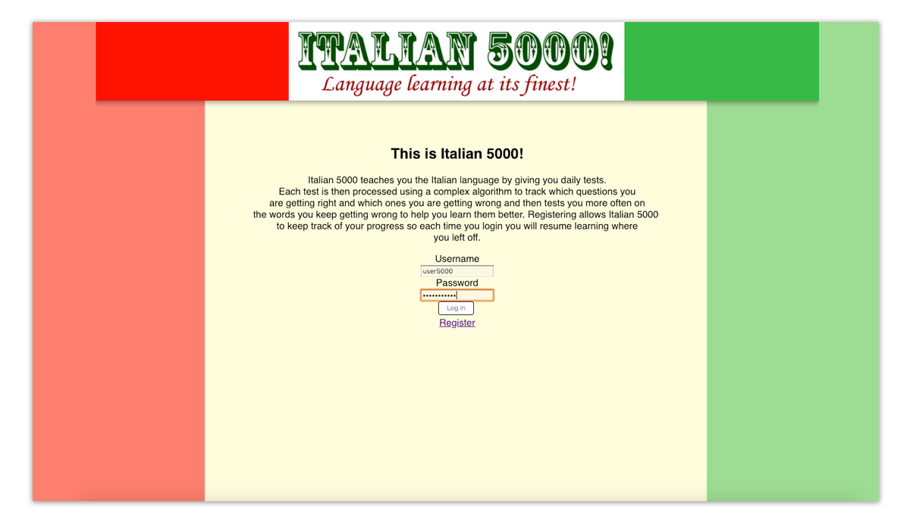
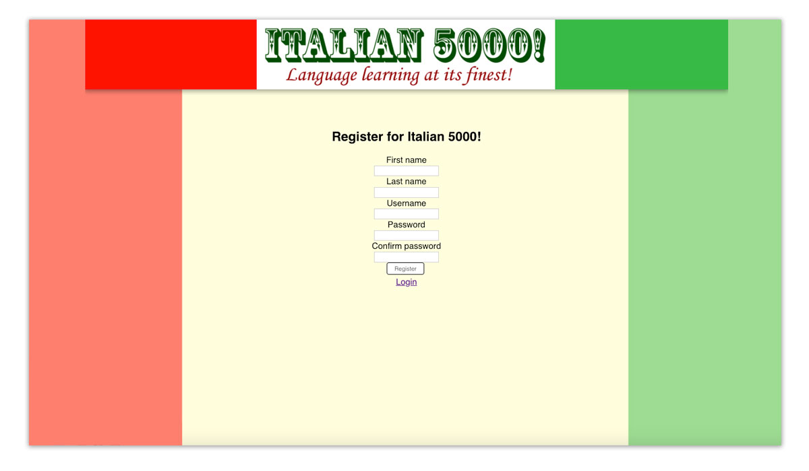
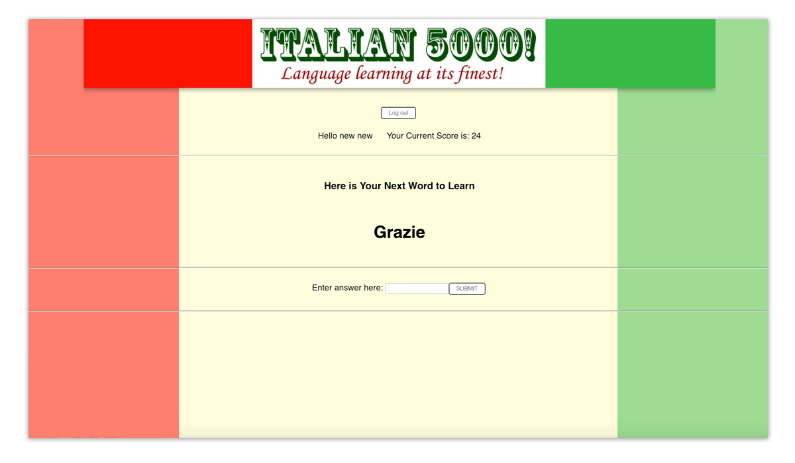
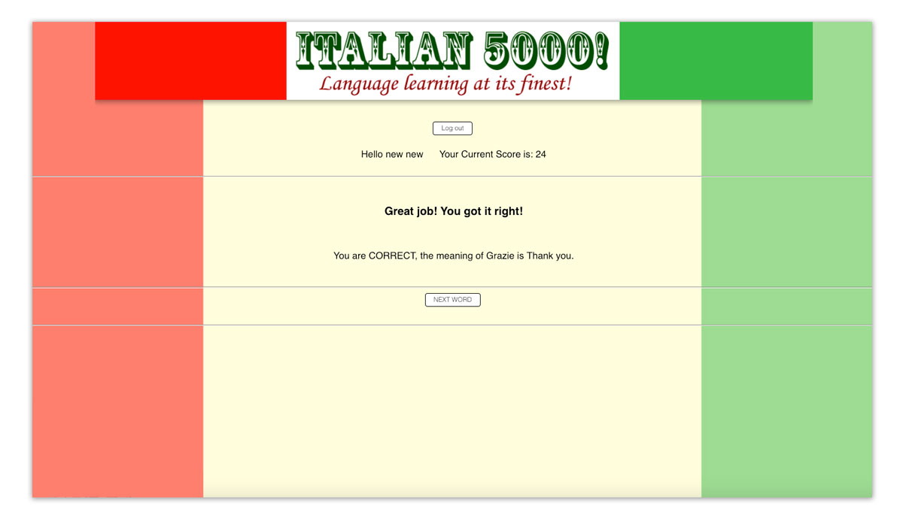

## Incrementum!

This is Incrementum!

Incrementum teaches you the Italian language by giving you daily tests.
Each test is then processed using a complex algorithm to track which questions you are getting right and which ones you are getting wrong and then tests you more often on the words you keep getting wrong to help you learn them better. Registering allows Incrementum to keep track of your progress so each time you login you will resume learning where you left off.

Godere!

### Link to deployed app: 
[https://fathomless-savannah-97450.herokuapp.com/](https://fathomless-savannah-97450.herokuapp.com/)

### Link to server github repo:
https://github.com/thinkful-ei26/Randy-RP-Spaced-Rep-Server

## Demo Account
Username: username123
Password: Password123

### Technical Stack:
- React for Frontend
- Redux for State Management
- Node and Express for backend
- MongoDB for the database

## User Log-in:


## New User Registration:


## Answer Mode:


## Right Answer:


## Wrong Answer:


```
my-app/
  README.md
node_modules/
  package.json
public/
  index.html
  favicon.ico
src/
  actions/
    auth.js
    users.js 
    words.js
    utils.js
  components/
    app.js
    dashboard.js
    game.js
    navbar.js
    hello-user.js
    input.js
    intro.info.js
    landing-page.js
    login-form.js
    registration-form.js
    registration-page.js
    requires-login.js
  reducers/
    auth.js
    current-word.js
    next-word.js
    set-order.js
    words.js
  images/
  index.css
  config.js
  local-storage.js
  index.js
  logo.svg
  store.js
  validators.js
```


